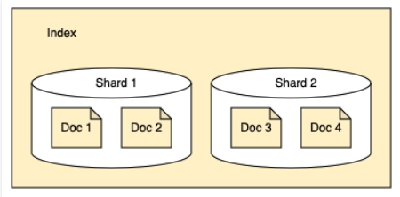
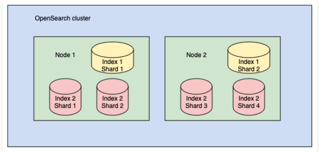
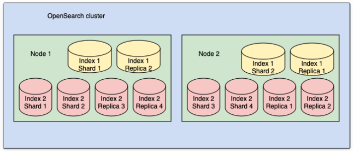

# OpenSearch Advanced Workshop: E-commerce Scenario

This workshop walks you through building a real e‑commerce search system with OpenSearch. We’ll work with a practical dataset, tune relevance so good results float to the top. 

---

## Table of Contents

### Part I: Foundations
- [1) OpenSearch Overview](#1-opensearch-overview)
- [2) Core Concepts](#2-core-concepts)
  - [Documents & Indexes](#documents--indexes)
  - [Arrays, Dot Notation, and Nested](#arrays-dot-notation-and-nested)
  - [Inverted Index](#inverted-index)
  - [Relevance (BM25)](#relevance-bm25)
- [3) Mapping (Field Types & Behavior)](#3-mapping-field-types--behavior)
- [4) Analyzers (How Text Becomes Searchable)](#4-analyzers-how-text-becomes-searchable)

### Part II: Workshop Setup
- [5) What You'll Build](#5-what-youll-build)
- [6) Architecture Overview](#6-architecture-overview)
- [7) Prerequisites](#7-prerequisites)
- [8) Environment Setup (Docker Compose)](#8-environment-setup-docker-compose)
- [9) The Dataset](#9-the-dataset)
  - [Relationships](#relationships)
  - [Index Mappings](#index-mappings)
  - [Seed Data](#seed-data)
  - [Quick Sanity Checks](#quick-sanity-checks)

### Part III: Querying & Analytics
- [10) Searching and Query Types](#10-searching-and-query-types)
- [11) Aggregations](#11-aggregations)
- [12) Working with Nested Data](#12-working-with-nested-data)

### Part IV: Search UX
- [13) Autocomplete & Suggestions](#13-autocomplete--suggestions)

### Part V: Advanced Topics
- [14) Performance & Best Practices](#14-performance--best-practices)
- [15) Scaling & Sharding Deep Dive](#15-scaling--sharding-deep-dive)
- [16) Vector Search & Hybrid Search](#16-vector-search--hybrid-search)

### Part VI: Wrap-up
- [17) Troubleshooting Notes](#17-troubleshooting-notes)
- [18) Teardown (Optional)](#18-teardown-optional)
- [19) Summary](#19-summary)
- [20) Quick Reference Guide](#20-quick-reference-guide)
  - [Common Query Patterns Cheat Sheet](#common-query-patterns-cheat-sheet)
  - [Query Decision Tree](#query-decision-tree)
  - [When to Use Filter vs Must](#when-to-use-filter-vs-must)
- [21) References](#21-references)

---

## Part I: Foundations

## 1) OpenSearch Overview

OpenSearch is an open-source search and analytics engine. Think Elasticsearch, but actually open. It’s Lucene under the hood, great for product search, logs, and real‑time dashboards.

### What people use it for
- **Website/App Search**: Product search, autocomplete, faceted filters
- **Log Analytics**: Centralized logs you can actually query when things break
- **Business Analytics**: Real‑time dashboards without waiting for nightly jobs

Once you index data, you get:
- Full‑text search that understands language
- Fast, exact filters and aggregations
- Built‑in visualizations in Dashboards

It handles text, numbers, dates, geo—basically any JSON you throw at it.

---

## 2) Core Concepts

### Documents & Indexes

Everything is a JSON document. If you’re coming from SQL: a document is like a row; an index is like a table.

**Example document:**
```json
{
  "name": "John Doe",
  "gpa": 3.89,
  "grad_year": 2022
}
```

Quick facts:
- Every document gets a unique `_id` (you can set it or let OpenSearch generate it)
- Dynamic mapping works for a demo; in production, define mappings explicitly
- Indexes scale to millions of documents

### Arrays, Dot Notation, and Nested

Object fields are flattened with dot notation (e.g., `user.name`). Arrays don’t have a special type—any field can have multiple values, just keep them the same type. For analyzed text arrays, token positions flow across elements.

**Quick demo:**
```json
POST /_analyze
{
  "text": ["there is a shop", "these apples are good"],
  "analyzer": "standard"
}
```
Positions continue across values; terms share posting lists.

#### The nested type (and when you actually need it)

If you store an array of objects without `nested`, Lucene flattens everything—easy to index, easy to get wrong in queries. Use `nested` when multiple fields must match within the same array item. The trade‑off: each nested item becomes a hidden Lucene document.

> 1 product with 10 reviews = 11 Lucene docs (1 parent + 10 nested)

**Example:**
```json
{
  "product": "Laptop",
  "reviews": [
    {"user": "alice", "rating": 5},
    {"user": "bob", "rating": 3}
  ]
}
```
Without `nested`, a query for `user:alice AND rating:3` incorrectly matches (values come from different objects). With `nested`, each review stays isolated.

### Inverted Index

Search is powered by an inverted index: terms map to the documents that contain them. Positions are stored too, which enables phrase and proximity queries.

#### How it works (quick demo)

Say you index three products:

```text
Doc 1: {"name": "Wireless Bluetooth Headphones"}
Doc 2: {"name": "USB Wireless Mouse"}
Doc 3: {"name": "Bluetooth Speaker"}
```

After analysis (lowercase, tokenization), OpenSearch builds this inverted index:

```
Term         → Doc IDs    Positions
"wireless"   → [1, 2]     [1:0, 2:1]
"bluetooth"  → [1, 3]     [1:1, 3:0]
"headphones" → [1]        [1:2]
"usb"        → [2]        [2:0]
"mouse"      → [2]        [2:2]
"speaker"    → [3]        [3:1]
```

**Position notation**: `[docID:position]` where position is the token offset in the document.

#### Why This Matters

1. **Fast lookups**: Query "wireless" → instant retrieval of docs [1, 2]
2. **Phrase queries**: "wireless bluetooth" checks if positions are adjacent in doc 1 (0, 1) — match!
3. **Proximity queries**: "bluetooth wireless" with slop=2 can match doc 1 (positions 1, 0 are within 2 positions)

#### Hands-on Demo

Create a test index and explore the inverted index:

```json
PUT /inverted_demo
{
  "settings": { "number_of_shards": 1 },
  "mappings": {
    "properties": {
      "title": { "type": "text" }
    }
  }
}

POST /inverted_demo/_doc/1
{"title": "Wireless Bluetooth Headphones"}

POST /inverted_demo/_doc/2
{"title": "USB Wireless Mouse"}

POST /inverted_demo/_doc/3
{"title": "Bluetooth Speaker"}
```

**Test 1: Term query (exact match)**
```json
GET /inverted_demo/_search
{
  "query": { "term": { "title": "wireless" } }
}
```
Returns docs 1 and 2.

**Test 2: Phrase query (position matters)**
```json
GET /inverted_demo/_search
{
  "query": { "match_phrase": { "title": "wireless bluetooth" } }
}
```
Returns only doc 1 (positions are adjacent: 0, 1).

**Test 3: Phrase with slop (proximity)**
```json
GET /inverted_demo/_search
{
  "query": { "match_phrase": { "title": { "query": "bluetooth wireless", "slop": 2 } } }
}
```
Returns doc 1 (positions 1, 0 are within slop distance).

**Inspect term vectors (see the inverted index)**
```json
GET /inverted_demo/_termvectors/1?fields=title&term_statistics=true&positions=true
```

This shows exactly how "Wireless Bluetooth Headphones" is indexed with positions and frequencies.

### Relevance (BM25)

**BM25** is the default scoring algorithm, combining:
- **TF (term frequency)**: more term occurrences → higher score
- **IDF (inverse document frequency)**: rarer terms → more weight
- **Length normalization**: shorter focused docs → slight boost

**Quick demo** (you can test this now before loading the full dataset):

First, create a simple test index and add a document:
```json
PUT /products_demo
{
  "mappings": {
    "properties": {
      "name": { "type": "text" }
    }
  }
}

POST /products_demo/_doc/1
{
  "name": "Wireless Bluetooth Headphones"
}

POST /products_demo/_doc/2
{
  "name": "USB Wireless Mouse"
}
```

Now search with `explain` to see BM25 scoring:
```json
GET /products_demo/_search
{
  "query": { "match": { "name": "wireless" } },
  "explain": true
}
```

**Expected result** (trimmed):
```json
{
  "hits": {
    "hits": [
      {
        "_id": "1",
        "_score": 0.18232156,
        "_explanation": {
          "value": 0.18232156,
          "description": "weight(name:wireless in 0) [PerFieldSimilarity], result of:",
          "details": [
            {
              "value": 0.18232156,
              "description": "score(freq=1.0), computed as boost * idf * tf from:",
              "details": [
                {"value": 2.2, "description": "boost"},
                {"value": 0.13353139, "description": "idf, computed as log(1 + (N - n + 0.5) / (n + 0.5))"},
                {"value": 0.6931472, "description": "tf, computed as freq / (freq + k1 * (1 - b + b * dl / avgdl))"}
              ]
            }
          ]
        }
      }
    ]
  }
}
```

Key components: `idf` (how rare "wireless" is), `tf` (how often it appears), `dl/avgdl` (document length vs average).

> **Note**: The full workshop dataset (section 9) includes 20 products with synonyms. This quick demo just shows how scoring works.

---

## 3) Mapping (Field Types & Behavior)

**Mappings** define field types and how they're indexed/searched. **Use explicit mappings in production** to avoid surprises.

### Common Field Types

| Type | Use Case |
|------|----------|
| `text` | Full-text relevance (analyzed) |
| `keyword` | Exact match, sort, aggregations (not analyzed) |
| `date` | Timestamps, date ranges |
| `integer`, `long`, `double`, `float` | Numeric values |
| `boolean` | True/false |
| `object` | Nested JSON (flattened via dot notation) |
| `nested` | Arrays of objects (queried independently) |
| `geo_point` | Latitude/longitude for geo queries |

### Keyword vs Text (Tokenization Check)

```json
POST /_analyze
{
  "analyzer": "keyword",
  "text": "Wireless Bluetooth Headphones"
}
```
A `keyword` field is stored as a **single token**; use it for filters, sorts, and aggregations. Use `text` for full-text search.

### Multi-field Pattern

Often you'll want both:
```json
{
  "name": {
    "type": "text",
    "fields": {
      "keyword": {"type": "keyword", "ignore_above": 256}
    }
  }
}
```
Now you can search on `name` (full-text) and sort/aggregate on `name.keyword` (exact).

### Type Coercion & Missing Fields

- **Coercion** converts types at index/query time (e.g., `"123"` → `123`). Prefer correct types; consider disabling:
```json
PUT /orders
{
  "mappings": {
    "properties": {
      "total_amount": { "type": "double", "coerce": false }
    }
  }
}
```
Or as an index setting:
```json
PUT /orders/_settings
{ "index.mapping.coerce": false }
```
- **Fields are optional**; don't index `null`. Enforce "required" in your app code.

### Object vs Nested

This is a common gotcha. Let's see the problem in action.

**Object (default) - The Bug:**
```json
PUT /catalog_object
{
  "mappings": {
    "properties": {
      "name": { "type": "text" },
      "reviews": {
        "properties": {
          "user":   { "type": "keyword" },
          "rating": { "type": "integer" }
        }
      }
    }
  }
}

POST /catalog_object/_doc/1
{
  "name": "Laptop",
  "reviews": [
    {"user": "alice", "rating": 5},
    {"user": "bob", "rating": 2}
  ]
}
```

Now query for "alice gave a rating of 2":
```json
GET /catalog_object/_search
{
  "query": {
    "bool": {
      "must": [
        {"term": {"reviews.user": "alice"}},
        {"term": {"reviews.rating": 2}}
      ]
    }
  }
}
```

**Result**: **Incorrectly matches!** (alice gave 5, bob gave 2, but Lucene mixed them up)

---

**Nested (isolated) - The Fix:**
```json
PUT /catalog_nested
{
  "mappings": {
    "properties": {
      "name": { "type": "text" },
      "reviews": {
        "type": "nested",
        "properties": {
          "user":   { "type": "keyword" },
          "rating": { "type": "integer" }
        }
      }
    }
  }
}

POST /catalog_nested/_doc/1
{
  "name": "Laptop",
  "reviews": [
    {"user": "alice", "rating": 5},
    {"user": "bob", "rating": 2}
  ]
}
```

Same query, but with `nested`:
```json
GET /catalog_nested/_search
{
  "query": {
    "nested": {
      "path": "reviews",
      "query": {
        "bool": {
          "must": [
            {"term": {"reviews.user": "alice"}},
            {"term": {"reviews.rating": 2}}
          ]
        }
      }
    }
  }
}
```

**Result**: **Correctly returns 0 matches** (alice gave 5, not 2)

**The difference**: Without `nested`, Lucene flattens to `["alice", "bob"]` and `[5, 2]` losing the connection. With `nested`, each review stays isolated.

### Dot Notation in Field Names

Use `path.subpath.field` to refer to flattened object fields or nested path properties.

---

## 4) Analyzers (How Text Becomes Searchable)

An **analyzer** = **char filters** + **tokenizer** + **token filters**. It normalizes text (lowercasing, punctuation removal, stemming, synonyms).

### Built-in Analyzers

| Analyzer | Behavior |
|----------|----------|
| `standard` | Default, general purpose (lowercase, split on word boundaries) |
| `keyword` | Entire field as one token (no analysis) |
| `whitespace` | Splits on spaces only |
| `english` | Stemming + stop words for English |

### Custom Analyzer with Synonyms

Let's build an analyzer that understands "headphones" and "headset" mean the same thing. This way, when someone searches for "headset", they'll also find products labeled "headphones".

**Create the index with synonym mapping:**
```json
PUT /products
{
  "settings": {
    "analysis": {
      "filter": {
        "synonym_filter": {
          "type": "synonym_graph",
          "synonyms": [
            "headphones, headset",
            "tv, television"
          ]
        }
      },
      "analyzer": {
        "custom_product_analyzer": {
          "tokenizer": "standard",
          "filter": ["lowercase", "asciifolding", "synonym_filter"]
        }
      }
    }
  },
  "mappings": {
    "properties": {
      "name": { "type": "text", "analyzer": "custom_product_analyzer" }
    }
  }
}
```

**What this does:**
- `tokenizer: standard` → splits text on spaces/punctuation
- `lowercase` → converts everything to lowercase
- `asciifolding` → removes accents (café → cafe)
- `synonym_filter` → expands synonyms (headset → headphones, headset)

**Test 1: See how standard analyzer works (no synonyms):**
```json
POST /_analyze
{
  "analyzer": "standard",
  "text": "Wireless Headphones"
}
```

**Result:**
```json
{
  "tokens": [
    {"token": "wireless", "position": 0},
    {"token": "headphones", "position": 1}
  ]
}
```

Just splits and lowercases - no synonym expansion.

**Test 2: See how our custom analyzer works (with synonyms):**
```json
POST /products/_analyze
{
  "field": "name",
  "text": "headset"
}
```

**Result:**
```json
{
  "tokens": [
    {"token": "headset", "position": 0},
    {"token": "headphones", "position": 0}
  ]
}
```

Notice both "headset" AND "headphones" are at position 0 - that's the synonym expansion! Now searching for either term will match both.

**Test 3: Multiple synonyms:**
```json
POST /products/_analyze
{
  "field": "name",
  "text": "TV"
}
```

**Result:**
```json
{
  "tokens": [
    {"token": "tv", "position": 0},
    {"token": "television", "position": 0}
  ]
}
```

Same deal - "TV" expands to include "television".

> **Why this matters**: Users search in different ways. Some say "headset", others say "headphones". Synonyms catch both without duplicating your product data.

---

## Part II: Workshop Setup

Alright, enough theory—let’s build something.

In this part you’ll spin up a two‑node OpenSearch cluster with Dashboards using Docker, load a small but realistic retail dataset, and sanity‑check the setup.

Why this matters:
- **Real data**: customers, products, orders—exactly what you’ll see in production
- **Repeatable**: Docker removes “works on my machine”
- **Complete**: mappings, analyzers, nested data, geo, and queries all in one place

You’ll learn how to structure indexes, choose analyzers, model one‑to‑many relationships, and verify everything with quick tests.
Plan ~20–30 minutes for setup and loading.

---

## 5) What You'll Build

A working, repeatable lab (Docker‑based) with a realistic retail dataset covering:

- **Index design**: mappings, analyzers, nested fields
- **Search**: match, term, phrase, boolean, fuzzy, synonyms
- **Relevance**: BM25, boosting, `minimum_should_match`, slop
- **Aggregations**: terms, metrics, pipelines, date histograms, filters
- **Search UX**: autocomplete, suggestions

Everything is runnable from **Dev Tools** in Dashboards.

---

## 6) Architecture Overview

OpenSearch is a distributed search/analytics engine built on Lucene.

### Stack

| Layer | Component |
|-------|-----------|
| **Storage** | Lucene segments managed by OpenSearch indexes |
| **Compute** | OpenSearch cluster (1–3 nodes local) |
| **Visualization** | OpenSearch Dashboards (Dev Tools, Charts, Dashboards) |
| **Ingestion** | REST/Bulk API (JSON Lines) |

---

## 7) Prerequisites

- **Docker Desktop** 4.x+
- **4 GB RAM** free (8 GB recommended)
- **Browser** (Chrome/Firefox)
- **Text editor** (VS Code, Sublime, etc.)

---

## 8) Environment Setup (Docker Compose)

> **Note**: This setup uses a development Docker Compose file with security disabled. **This configuration disables security and should only be used in test environments.**

### Prerequisite

Before you begin, install [Docker](https://www.docker.com/) on your machine.

### Set up a cluster without security

1. Create a directory for your OpenSearch cluster (for example, `opensearch-cluster`). Create a `docker-compose.yml` file in this directory and copy the contents of the [Docker Compose file for development](https://docs.opensearch.org/latest/install-and-configure/install-opensearch/docker/#sample-docker-compose-file-for-development) into this file.

2. Start the cluster by running the following command:

```bash
docker compose up -d
```

3. Check that the containers are running:

```bash
docker compose ps
```

You should see an output similar to the following:

```
NAME                    COMMAND                  SERVICE               STATUS
opensearch-dashboards   "./opensearch-dashb…"    opensearch-dashboards running
opensearch-node1        "./opensearch-docker…"   opensearch-node1      running
opensearch-node2        "./opensearch-docker…"   opensearch-node2      running
```

4. To verify that OpenSearch is running, send the following request:

```bash
curl http://localhost:9200
```

You should see JSON with cluster info.

5. You can now explore OpenSearch Dashboards by opening `http://localhost:5601/` in your browser.

Go to **Dev Tools** (hamburger menu → Management → Dev Tools) to run queries.

---

## 9) The Dataset

We'll work with a realistic e-commerce dataset that covers the core challenges you'll face in production: mixed field types, text search with synonyms, and nested relationships.

**Three main entities:**

- **customers** – profiles with text, exact-match fields, geo coordinates, and dates
- **products** – searchable names/descriptions with custom analyzers and synonym support
- **orders** – order headers with nested line items (the tricky part)

**Key design patterns to notice:**

- **Denormalization**: We duplicate product names in order items. No joins means faster queries.
- **Nested data**: Order items use `nested` type to keep relationships intact (so "Electronics AND price > €100" checks the same line item, not separate ones)
- **Multi-field strategy**: Product names are indexed as both `text` (for search) and `keyword` (for sorting/aggregations)
- **Geo-points**: Customer locations let you run proximity searches

This structure scales to millions of documents and supports product search, customer segmentation, order analytics, and recommendations—the building blocks of most e-commerce search systems.

> **Note for Vector Search (Section 16)**: If you plan to work through the Vector Search section later, you'll need Python 3.7+ installed on your machine. Two Python scripts (`index_products_with_vectors.py` and `search_with_vectors.py`) are available in this workshop repository to help you generate and search with vectors. We'll cover the setup details in Section 16.

---

### Relationships

```
Customer (1) ─ (N) Order (1) ─ (N) OrderItem (nested in Order)
Product  (1) ─ (N) OrderItem
```

### Index Mappings

#### customers

```json
PUT customers
{
  "settings": { "number_of_shards": 1, "number_of_replicas": 0 },
  "mappings": {
    "properties": {
      "customer_id":  { "type": "keyword" },
      "email":        { "type": "keyword" },
      "full_name":    { "type": "text", "fields": { "keyword": {"type":"keyword","ignore_above":256} } },
      "country":      { "type": "keyword" },
      "city":         { "type": "keyword" },
      "signup_date":  { "type": "date" },
      "loyalty_tier": { "type": "keyword" },
      "interests":    { "type": "keyword" },
      "location":     { "type": "geo_point" },
      "notes":        { "type": "text" }
    }
  }
}
```

#### products (custom analyzer + synonyms)

```json
PUT products
{
  "settings": {
    "number_of_shards": 1,
    "number_of_replicas": 0,
    "analysis": {
      "filter": {
        "en_stop": { "type": "stop", "stopwords": "_english_" },
        "en_stem": { "type": "stemmer", "language": "english" },
        "product_synonyms": {
          "type": "synonym_graph",
          "lenient": true,
          "synonyms": [
            "headphones, headset",
            "earbuds, in-ear",
            "tv, television",
            "vacuum, hoover",
            "trainer, running shoes, sneaker, sneakers",
            "usb-c, type-c"
          ]
        }
      },
      "analyzer": {
        "product_analyzer": {
          "type": "custom",
          "tokenizer": "standard",
          "filter": ["lowercase", "asciifolding", "en_stop", "en_stem", "product_synonyms"]
        }
      }
    }
  },
  "mappings": {
    "properties": {
      "product_id":   { "type": "keyword" },
      "name":         { "type": "text", "analyzer": "product_analyzer", "fields": { "keyword": {"type":"keyword","ignore_above":256} } },
      "description":  { "type": "text", "analyzer": "product_analyzer" },
      "category":     { "type": "keyword" },
      "brand":        { "type": "keyword" },
      "price":        { "type": "double" },
      "in_stock":     { "type": "boolean" },
      "tags":         { "type": "keyword" },
      "release_date": { "type": "date" },
      "rating":       { "type": "float" }
    }
  }
}
```

#### orders (with nested items)

```json
PUT orders
{
  "settings": { "number_of_shards": 1, "number_of_replicas": 0 },
  "mappings": {
    "properties": {
      "order_id":      { "type": "keyword" },
      "customer_id":   { "type": "keyword" },
      "order_date":    { "type": "date" },
      "status":        { "type": "keyword" },
      "country":       { "type": "keyword" },
      "payment_method":{ "type": "keyword" },
      "total_amount":  { "type": "double" },
      "items": {
        "type": "nested",
        "properties": {
          "product_id":   { "type": "keyword" },
          "product_name": { "type": "text", "fields": { "keyword": {"type":"keyword"} } },
          "category":     { "type": "keyword" },
          "unit_price":   { "type": "double" },
          "quantity":     { "type": "integer" },
          "line_total":   { "type": "double" }
        }
      }
    }
  }
}
```

### Seed Data

#### products (20 docs)

```json
POST _bulk
{ "index": { "_index": "products", "_id": "P-1001" } }
{ "product_id":"P-1001","name":"Wireless Headphones","description":"Over ear wireless headset with noise reduction and usb-c charging.","category":"Electronics","brand":"Auron","price":89.99,"in_stock":true,"tags":["audio","wireless","usb-c"],"release_date":"2025-06-15","rating":4.5 }
{ "index": { "_index": "products", "_id": "P-1002" } }
{ "product_id":"P-1002","name":"In Ear Earbuds","description":"Compact in ear earbuds with microphone and long battery life.","category":"Electronics","brand":"Auron","price":49.50,"in_stock":true,"tags":["audio","earbuds"],"release_date":"2025-03-21","rating":4.2 }
{ "index": { "_index": "products", "_id": "P-1003" } }
{ "product_id":"P-1003","name":"USB C Hub 6 in 1","description":"Type C hub with HDMI, USB 3.0, SD, microSD, and PD.","category":"Electronics","brand":"NuLink","price":34.99,"in_stock":true,"tags":["usb-c","hub"],"release_date":"2025-02-05","rating":4.1 }
{ "index": { "_index": "products", "_id": "P-1004" } }
{ "product_id":"P-1004","name":"Mechanical Keyboard","description":"RGB mechanical keyboard with hot swappable switches.","category":"Electronics","brand":"KeyForge","price":119.00,"in_stock":true,"tags":["keyboard","mechanical"],"release_date":"2025-04-11","rating":4.6 }
{ "index": { "_index": "products", "_id": "P-1005" } }
{ "product_id":"P-1005","name":"1080p Webcam","description":"Full HD webcam with privacy shutter and dual microphones.","category":"Electronics","brand":"ViewPro","price":49.99,"in_stock":true,"tags":["camera","webcam"],"release_date":"2025-05-05","rating":4.0 }
{ "index": { "_index": "products", "_id": "P-1006" } }
{ "product_id":"P-1006","name":"Bluetooth Speaker","description":"Portable speaker with deep bass and 12h playtime.","category":"Electronics","brand":"Boomlet","price":35.00,"in_stock":true,"tags":["audio","speaker"],"release_date":"2025-01-20","rating":4.3 }
{ "index": { "_index": "products", "_id": "P-1007" } }
{ "product_id":"P-1007","name":"Noise Canceling Earbuds","description":"ANC earbuds with transparency mode.","category":"Electronics","brand":"Auron","price":149.00,"in_stock":true,"tags":["audio","earbuds","anc"],"release_date":"2025-07-01","rating":4.4 }
{ "index": { "_index": "products", "_id": "P-1008" } }
{ "product_id":"P-1008","name":"Data Modeling 101 (Book)","description":"An introduction to data modeling principles.","category":"Books","brand":"TechPress","price":24.50,"in_stock":true,"tags":["book","data"],"release_date":"2024-10-01","rating":4.7 }
{ "index": { "_index": "products", "_id": "P-1009" } }
{ "product_id":"P-1009","name":"Effective Meetings (Book)","description":"Run productive meetings with practical templates.","category":"Books","brand":"BizPub","price":18.00,"in_stock":true,"tags":["book","meetings"],"release_date":"2024-08-12","rating":4.0 }
{ "index": { "_index": "products", "_id": "P-1010" } }
{ "product_id":"P-1010","name":"SQL for Everyone (Book)","description":"Friendly guide to SQL for analysts.","category":"Books","brand":"TechPress","price":29.00,"in_stock":true,"tags":["book","sql"],"release_date":"2024-07-20","rating":4.5 }
{ "index": { "_index": "products", "_id": "P-1011" } }
{ "product_id":"P-1011","name":"Desk Lamp","description":"LED desk lamp with adjustable color temperature.","category":"Home","brand":"Luma","price":29.99,"in_stock":true,"tags":["home","lighting"],"release_date":"2025-03-10","rating":4.1 }
{ "index": { "_index": "products", "_id": "P-1012" } }
{ "product_id":"P-1012","name":"Air Purifier","description":"HEPA air purifier for large rooms.","category":"Home","brand":"PureAir","price":199.00,"in_stock":true,"tags":["home","air"],"release_date":"2024-12-10","rating":4.2 }
{ "index": { "_index": "products", "_id": "P-1013" } }
{ "product_id":"P-1013","name":"Coffee Grinder","description":"Stainless steel burr grinder with 16 settings.","category":"Home","brand":"Brewly","price":39.50,"in_stock":true,"tags":["home","kitchen"],"release_date":"2025-04-01","rating":4.0 }
{ "index": { "_index": "products", "_id": "P-1014" } }
{ "product_id":"P-1014","name":"Yoga Mat","description":"Non slip yoga mat for home workouts.","category":"Sports","brand":"FlexFit","price":25.00,"in_stock":true,"tags":["sports","yoga"],"release_date":"2024-11-01","rating":4.3 }
{ "index": { "_index": "products", "_id": "P-1015" } }
{ "product_id":"P-1015","name":"Running Shoes","description":"Lightweight sneakers for daily training.","category":"Sports","brand":"Fleet","price":89.00,"in_stock":true,"tags":["sports","shoes","trainer"],"release_date":"2025-05-15","rating":4.2 }
{ "index": { "_index": "products", "_id": "P-1016" } }
{ "product_id":"P-1016","name":"Building Blocks","description":"Colorful blocks for kids aged 3+.","category":"Toys","brand":"Blocko","price":19.99,"in_stock":true,"tags":["toys","blocks"],"release_date":"2025-02-01","rating":4.6 }
{ "index": { "_index": "products", "_id": "P-1017" } }
{ "product_id":"P-1017","name":"USB C Cable 2m","description":"Fast charge Type C cable, braided.","category":"Electronics","brand":"NuLink","price":12.99,"in_stock":true,"tags":["usb-c","cable"],"release_date":"2025-03-18","rating":4.1 }
{ "index": { "_index": "products", "_id": "P-1018" } }
{ "product_id":"P-1018","name":"Bluetooth Trackers (4 pack)","description":"Find lost items with phone app.","category":"Electronics","brand":"Findr","price":39.99,"in_stock":true,"tags":["tracker","bluetooth"],"release_date":"2025-01-25","rating":4.0 }
{ "index": { "_index": "products", "_id": "P-1019" } }
{ "product_id":"P-1019","name":"TV 55\" 4K","description":"55 inch 4K UHD television with HDR.","category":"Electronics","brand":"ViewPro","price":489.00,"in_stock":true,"tags":["tv","television","4k"],"release_date":"2024-09-09","rating":4.4 }
{ "index": { "_index": "products", "_id": "P-1020" } }
{ "product_id":"P-1020","name":"Vacuum Cleaner","description":"Bagless vacuum with strong suction.","category":"Home","brand":"Hoova","price":129.00,"in_stock":true,"tags":["vacuum","cleaning"],"release_date":"2025-06-01","rating":4.1 }
```

#### customers (12 docs)

```json
POST _bulk
{ "index": { "_index": "customers", "_id": "C-001" } }
{ "customer_id":"C-001","email":"ana@example.com","full_name":"Ana García","country":"Spain","city":"Madrid","signup_date":"2024-11-10","loyalty_tier":"gold","interests":["audio","books"],"location":"40.4168,-3.7038","notes":"Prefers wireless audio" }
{ "index": { "_index": "customers", "_id": "C-002" } }
{ "customer_id":"C-002","email":"luis@example.com","full_name":"Luis Fernández","country":"Spain","city":"Barcelona","signup_date":"2025-01-05","loyalty_tier":"silver","interests":["electronics","sports"],"location":"41.3874,2.1686","notes":"Runner" }
{ "index": { "_index": "customers", "_id": "C-003" } }
{ "customer_id":"C-003","email":"sanna@example.fi","full_name":"Sanna Korhonen","country":"Finland","city":"Helsinki","signup_date":"2024-12-20","loyalty_tier":"bronze","interests":["toys","books"],"location":"60.1699,24.9384","notes":"Buys for kids" }
{ "index": { "_index": "customers", "_id": "C-004" } }
{ "customer_id":"C-004","email":"hans@example.de","full_name":"Hans Müller","country":"Germany","city":"Berlin","signup_date":"2025-02-10","loyalty_tier":"silver","interests":["home","electronics"],"location":"52.5200,13.4050","notes":"Likes smart home" }
{ "index": { "_index": "customers", "_id": "C-005" } }
{ "customer_id":"C-005","email":"marta@example.com","full_name":"Marta López","country":"Spain","city":"Valencia","signup_date":"2025-03-01","loyalty_tier":"gold","interests":["sports","audio"],"location":"39.4699,-0.3763","notes":"Trainer, listens to podcasts" }
{ "index": { "_index": "customers", "_id": "C-006" } }
{ "customer_id":"C-006","email":"erik@example.se","full_name":"Erik Svensson","country":"Sweden","city":"Stockholm","signup_date":"2025-01-18","loyalty_tier":"bronze","interests":["sports","home"],"location":"59.3293,18.0686","notes":"Occasional buyer" }
{ "index": { "_index": "customers", "_id": "C-007" } }
{ "customer_id":"C-007","email":"sofia@example.com","full_name":"Sofía Martín","country":"Spain","city":"Sevilla","signup_date":"2024-10-30","loyalty_tier":"silver","interests":["books","home"],"location":"37.3891,-5.9845","notes":"Reads weekly" }
{ "index": { "_index": "customers", "_id": "C-008" } }
{ "customer_id":"C-008","email":"marco@example.it","full_name":"Marco Rossi","country":"Italy","city":"Milan","signup_date":"2025-02-22","loyalty_tier":"bronze","interests":["home","coffee"],"location":"45.4642,9.1900","notes":"Coffee gear" }
{ "index": { "_index": "customers", "_id": "C-009" } }
{ "customer_id":"C-009","email":"laura@example.com","full_name":"Laura Gómez","country":"Spain","city":"Málaga","signup_date":"2025-03-10","loyalty_tier":"gold","interests":["electronics","tv"],"location":"36.7213,-4.4214","notes":"Interested in 4K TV" }
{ "index": { "_index": "customers", "_id": "C-010" } }
{ "customer_id":"C-010","email":"joao@example.pt","full_name":"João Silva","country":"Portugal","city":"Porto","signup_date":"2025-01-12","loyalty_tier":"silver","interests":["books","sql"],"location":"41.1579,-8.6291","notes":"SQL learner" }
{ "index": { "_index": "customers", "_id": "C-011" } }
{ "customer_id":"C-011","email":"emma@example.co.uk","full_name":"Emma Clark","country":"UK","city":"London","signup_date":"2024-12-01","loyalty_tier":"gold","interests":["home","air"],"location":"51.5074,-0.1278","notes":"Air quality" }
{ "index": { "_index": "customers", "_id": "C-012" } }
{ "customer_id":"C-012","email":"peter@example.de","full_name":"Peter Schmidt","country":"Germany","city":"Munich","signup_date":"2025-03-22","loyalty_tier":"bronze","interests":["electronics","audio"],"location":"48.1351,11.5820","notes":"Discount buyer" }
```

#### orders (15 docs with nested items)

```json
POST _bulk
{ "index": { "_index": "orders", "_id": "O-1001" } }
{ "order_id":"O-1001","customer_id":"C-001","order_date":"2025-10-01","status":"delivered","country":"Spain","payment_method":"card","total_amount":89.99,"items":[{"product_id":"P-1001","product_name":"Wireless Headphones","category":"Electronics","unit_price":89.99,"quantity":1,"line_total":89.99}]}
{ "index": { "_index": "orders", "_id": "O-1002" } }
{ "order_id":"O-1002","customer_id":"C-002","order_date":"2025-10-02","status":"delivered","country":"Spain","payment_method":"paypal","total_amount":49.00,"items":[{"product_id":"P-1008","product_name":"Data Modeling 101 (Book)","category":"Books","unit_price":24.50,"quantity":2,"line_total":49.00}]}
{ "index": { "_index": "orders", "_id": "O-1003" } }
{ "order_id":"O-1003","customer_id":"C-003","order_date":"2025-10-03","status":"delivered","country":"Finland","payment_method":"card","total_amount":19.99,"items":[{"product_id":"P-1016","product_name":"Building Blocks","category":"Toys","unit_price":19.99,"quantity":1,"line_total":19.99}]}
{ "index": { "_index": "orders", "_id": "O-1004" } }
{ "order_id":"O-1004","customer_id":"C-001","order_date":"2025-10-05","status":"returned","country":"Spain","payment_method":"card","total_amount":34.99,"items":[{"product_id":"P-1003","product_name":"USB C Hub 6 in 1","category":"Electronics","unit_price":34.99,"quantity":1,"line_total":34.99}]}
{ "index": { "_index": "orders", "_id": "O-1005" } }
{ "order_id":"O-1005","customer_id":"C-004","order_date":"2025-10-06","status":"delivered","country":"Germany","payment_method":"card","total_amount":29.99,"items":[{"product_id":"P-1011","product_name":"Desk Lamp","category":"Home","unit_price":29.99,"quantity":1,"line_total":29.99}]}
{ "index": { "_index": "orders", "_id": "O-1006" } }
{ "order_id":"O-1006","customer_id":"C-005","order_date":"2025-10-06","status":"delivered","country":"Spain","payment_method":"card","total_amount":119.00,"items":[{"product_id":"P-1004","product_name":"Mechanical Keyboard","category":"Electronics","unit_price":119.00,"quantity":1,"line_total":119.00}]}
{ "index": { "_index": "orders", "_id": "O-1007" } }
{ "order_id":"O-1007","customer_id":"C-006","order_date":"2025-10-07","status":"delivered","country":"Sweden","payment_method":"paypal","total_amount":25.00,"items":[{"product_id":"P-1014","product_name":"Yoga Mat","category":"Sports","unit_price":25.00,"quantity":1,"line_total":25.00}]}
{ "index": { "_index": "orders", "_id": "O-1008" } }
{ "order_id":"O-1008","customer_id":"C-007","order_date":"2025-10-10","status":"delivered","country":"Spain","payment_method":"card","total_amount":54.00,"items":[{"product_id":"P-1009","product_name":"Effective Meetings (Book)","category":"Books","unit_price":18.00,"quantity":3,"line_total":54.00}]}
{ "index": { "_index": "orders", "_id": "O-1009" } }
{ "order_id":"O-1009","customer_id":"C-002","order_date":"2025-10-12","status":"cancelled","country":"Spain","payment_method":"card","total_amount":49.99,"items":[{"product_id":"P-1005","product_name":"1080p Webcam","category":"Electronics","unit_price":49.99,"quantity":1,"line_total":49.99}]}
{ "index": { "_index": "orders", "_id": "O-1010" } }
{ "order_id":"O-1010","customer_id":"C-008","order_date":"2025-10-15","status":"delivered","country":"Italy","payment_method":"paypal","total_amount":39.50,"items":[{"product_id":"P-1013","product_name":"Coffee Grinder","category":"Home","unit_price":39.50,"quantity":1,"line_total":39.50}]}
{ "index": { "_index": "orders", "_id": "O-1011" } }
{ "order_id":"O-1011","customer_id":"C-009","order_date":"2025-10-18","status":"delivered","country":"Spain","payment_method":"card","total_amount":89.00,"items":[{"product_id":"P-1015","product_name":"Running Shoes","category":"Sports","unit_price":89.00,"quantity":1,"line_total":89.00}]}
{ "index": { "_index": "orders", "_id": "O-1012" } }
{ "order_id":"O-1012","customer_id":"C-003","order_date":"2025-10-20","status":"delivered","country":"Finland","payment_method":"card","total_amount":29.00,"items":[{"product_id":"P-1010","product_name":"SQL for Everyone (Book)","category":"Books","unit_price":29.00,"quantity":1,"line_total":29.00}]}
{ "index": { "_index": "orders", "_id": "O-1013" } }
{ "order_id":"O-1013","customer_id":"C-010","order_date":"2025-10-22","status":"delivered","country":"Portugal","payment_method":"paypal","total_amount":70.00,"items":[{"product_id":"P-1006","product_name":"Bluetooth Speaker","category":"Electronics","unit_price":35.00,"quantity":2,"line_total":70.00}]}
{ "index": { "_index": "orders", "_id": "O-1014" } }
{ "order_id":"O-1014","customer_id":"C-011","order_date":"2025-10-24","status":"delivered","country":"UK","payment_method":"card","total_amount":199.00,"items":[{"product_id":"P-1012","product_name":"Air Purifier","category":"Home","unit_price":199.00,"quantity":1,"line_total":199.00}]}
{ "index": { "_index": "orders", "_id": "O-1015" } }
{ "order_id":"O-1015","customer_id":"C-012","order_date":"2025-10-26","status":"delivered","country":"Germany","payment_method":"card","total_amount":149.00,"items":[{"product_id":"P-1007","product_name":"Noise Canceling Earbuds","category":"Electronics","unit_price":149.00,"quantity":1,"line_total":149.00}]}
```

### Quick Sanity Checks

```json
GET products/_count
GET customers/_count
GET orders/_count
```

Expected: 20 products, 12 customers, 15 orders.

### Comprehensive Testing Examples

Now that data is loaded, let's verify everything works correctly.

#### Test 1: Verify Index Mappings

```json
GET products/_mapping
GET customers/_mapping
GET orders/_mapping
```

**Expected**: 
- In `products` mapping: `name` field has `"analyzer": "product_analyzer"`
- In `orders` mapping: `items` field has `"type": "nested"`

#### Test 2: Verify Custom Analyzer

```json
POST /products/_analyze
{
  "field": "name",
  "text": "headset"
}
```

**Expected result:**
```json
{
  "tokens": [
    {"token": "headset", "position": 0},
    {"token": "headphones", "position": 0}
  ]
}
```

Both "headset" and its synonym "headphones" appear at position 0 - this means they're treated as equivalent during search.

#### Test 3: Sample Document Retrieval

```json
GET products/_doc/P-1001
GET customers/_doc/C-001
GET orders/_doc/O-1001
```

**Expected**: Full documents with all fields populated.

#### Test 4: Basic Search (Synonym Test)

```json
GET products/_search
{
  "query": { "match": { "name": "headset" } }
}
```

**Expected**: Returns "Wireless Headphones" (P-1001) due to synonym mapping.

Example (trimmed):
```json
{
  "hits": {
    "total": {"value": 1, "relation": "eq"},
    "hits": [
      {"_id": "P-1001", "_source": {"name": "Wireless Headphones"}}
    ]
  }
}
```

#### Test 5: Nested Query Test

```json
GET orders/_search
{
  "query": {
    "nested": {
      "path": "items",
      "query": {
        "bool": {
          "must": [
            {"term": {"items.category": "Electronics"}},
            {"range": {"items.unit_price": {"gte": 100}}}
          ]
        }
      }
    }
  }
}
```

**Expected**: Returns orders O-1006 (Mechanical Keyboard €119) and O-1015 (Noise Canceling Earbuds €149).

Example (trimmed):
```json
{
  "hits": {
    "total": {"value": 2, "relation": "eq"},
    "hits": [
      {"_id": "O-1006", "_source": {"items": [{"category": "Electronics", "unit_price": 119.0}]}},
      {"_id": "O-1015", "_source": {"items": [{"category": "Electronics", "unit_price": 149.0}]}}
    ]
  }
}
```

#### Test 6: Geo Query Test

```json
GET customers/_search
{
  "query": {
    "geo_distance": {
      "distance": "100km",
      "location": {"lat": 40.4168, "lon": -3.7038}
    }
  }
}
```

**Expected**: Returns customers near Madrid (C-001 Ana García).

#### Test 7: Aggregation Test

```json
GET orders/_search
{
  "size": 0,
  "aggs": {
    "total_revenue": {"sum": {"field": "total_amount"}},
    "avg_order": {"avg": {"field": "total_amount"}},
    "order_count": {"value_count": {"field": "order_id"}}
  }
}
```

**Expected**: 
- Total revenue: €1,047.45
- Average order: €69.83
- Order count: 15

Example (trimmed):
```json
{
  "aggregations": {
    "order_count": {"value": 15},
    "total_revenue": {"value": 1047.45},
    "avg_order": {"value": 69.83}
  }
}
```

#### Test 8: Date Range Test

```json
GET orders/_search
{
  "query": {
    "range": {
      "order_date": {
        "gte": "2025-10-01",
        "lte": "2025-10-10"
      }
    }
  }
}
```

**Expected**: Returns orders O-1001 through O-1008 (8 orders in first 10 days).

#### Test 9: Multi-field Search Test

```json
GET products/_search
{
  "query": {
    "multi_match": {
      "query": "wireless audio",
      "fields": ["name", "description", "tags"]
    }
  }
}
```

**Expected**: Returns P-1001 (Wireless Headphones). The query searches across multiple fields (name, description, tags) - this product matches because it has "wireless" in the name and "audio" in the tags.

Example (trimmed):
```json
{
  "hits": {
    "total": {"value": 1},
    "hits": [
      {
        "_id": "P-1001",
        "_score": 1.403,
        "_source": {
          "name": "Wireless Headphones",
          "tags": ["audio", "wireless"]
        }
      }
    ]
  }
}
```


#### Test 10: Fuzzy Search Test

```json
GET products/_search
{
  "query": {
    "match": {
      "name": {
        "query": "wireles hedphones",
        "fuzziness": "AUTO"
      }
    }
  }
}
```

**Expected**: Returns "Wireless Headphones" despite typos.

#### Test 11: Boolean Logic Test

```json
GET products/_search
{
  "query": {
    "bool": {
      "must": [
        {"term": {"category": "Electronics"}}
      ],
      "should": [
        {"match": {"name": "wireless"}},
        {"match": {"tags": "audio"}}
      ],
      "filter": [
        {"range": {"price": {"lte": 100}}}
      ],
      "minimum_should_match": 1
    }
  }
}
```

**What this does:**
- `must`: REQUIRED - must be Electronics
- `filter`: REQUIRED - price must be ≤ €100 (doesn't affect score)
- `should`: OPTIONAL - boosts score if matched
- `minimum_should_match: 1`: At least 1 of the `should` clauses must match

Without `minimum_should_match`, the `should` clauses would be truly optional (nice to have, but not required). With `minimum_should_match: 1`, at least one must match.

**Expected**: Electronics under €100 with either "wireless" in name OR "audio" in tags (or both).

#### Test 12: Highlighting Test

```json
GET products/_search
{
  "query": {"match": {"description": "noise reduction"}},
  "highlight": {
    "fields": {"description": {}}
  }
}
```

**Expected**: Returns P-1001 with `<em>noise</em> <em>reduction</em>` in highlight.

Example (trimmed):
```json
{
  "hits": {
    "hits": [
      {
        "_id": "P-1001",
        "highlight": {"description": ["... <em>noise</em> <em>reduction</em> ..."]}
      }
    ]
  }
}
```

#### Test 13: Nested Aggregation Test

```json
GET orders/_search
{
  "size": 0,
  "aggs": {
    "items_agg": {
      "nested": {"path": "items"},
      "aggs": {
        "by_category": {
          "terms": {"field": "items.category"},
          "aggs": {
            "revenue": {"sum": {"field": "items.line_total"}},
            "avg_price": {"avg": {"field": "items.unit_price"}}
          }
        }
      }
    }
  }
}
```

**Expected**: Revenue and average price per category (Electronics, Books, Home, Sports, Toys).

#### Test 14: Exists Query Test

```json
GET customers/_search
{
  "query": {
    "bool": {
      "must": [
        {"exists": {"field": "location"}},
        {"term": {"loyalty_tier": "gold"}}
      ]
    }
  }
}
```

**What this does**: The `exists` query finds documents where a field has any value (not null or missing). This is useful for finding customers who have provided their location.


#### Test 15: Terms Aggregation with Order

```json
GET products/_search
{
  "size": 0,
  "aggs": {
    "top_brands": {
      "terms": {
        "field": "brand",
        "size": 5,
        "order": {"_count": "desc"}
      }
    }
  }
}
```

**Expected**: Top brands by product count (Auron, NuLink, etc.).

---

## Part III: Querying & Analytics

Now the fun part: queries and analytics. This is where the pieces click.

Why this matters:
- Different problems need different query types (full‑text vs exact)
- Filters make things fast; scoring makes things relevant
- A bit of tuning often turns “good enough” into “this feels right”

What you’ll learn:
- 8 core query types you’ll actually use
- How to combine must/should/filter sanely
- Aggregations for real‑time analytics
- How to query nested data without getting tripped up

Mental model:
- Horizontal: decide what to include (filters, ranges, terms)
- Vertical: decide how to rank it (scoring, boosting)

It might take ~45–60 minutes to work through the examples.

---

## 10) Searching and Query Types

Pick the right tool:

Two families:
- Full‑text queries (analyze text; use on `text`)
- Exact‑value queries (no analysis; use on `keyword`, numeric, date)

### 1) Match (full-text)

**Example with OR (default):**
```json
GET /products/_search
{
  "query": { "match": { "name": "wireless keyboard" } }
}
```

**Expected**: Returns 2 products:
- P-1001: Wireless Headphones (has "wireless")
- P-1004: Mechanical Keyboard (has "keyboard")

Both match because the default operator is OR - documents with "wireless" OR "keyboard" are returned.

Example (trimmed):
```json
{
  "hits": {
    "total": {"value": 2},
    "hits": [
      {"_id": "P-1001", "_source": {"name": "Wireless Headphones"}},
      {"_id": "P-1004", "_source": {"name": "Mechanical Keyboard"}}
    ]
  }
}
```

**Test with AND operator** (requires BOTH terms):
```json
GET /products/_search
{
  "query": { 
    "match": { 
      "name": {
        "query": "wireless keyboard",
        "operator": "and"
      }
    } 
  }
}
```

**Expected**: Returns 0 results because no product has BOTH "wireless" AND "keyboard" in the name.

This shows the difference: OR finds documents matching ANY term, AND requires ALL terms.

### 2) Term (exact match)

```json
GET /orders/_search
{
  "query": { "term": { "status": "delivered" } }
}
```

Exact match on `keyword` field; case-sensitive.

**Expected Results:** 13 orders with status "delivered" (excludes O-1004 "returned" and O-1009 "cancelled").

**Test case sensitivity:**
```json
GET /orders/_search
{
  "query": { "term": { "status": "Delivered" } }
}
```
Returns 0 results (case mismatch).

**Test with terms (multiple values):**
```json
GET /orders/_search
{
  "query": { "terms": { "status": ["delivered", "returned"] } }
}
```
Returns 14 orders (delivered + returned).

### 3) Boolean (combine must/should/filter)

```json
GET /orders/_search
{
  "query": {
    "bool": {
      "must":   [ { "match": { "country": "Spain" } } ],
      "filter": [
        { "term":  { "status": "delivered" } },
        { "range": { "total_amount": { "gte": 50 } } }
      ]
    }
  }
}
```

- `must`: contributes to score
- `filter`: no scoring, cached
- `should`: optional, boosts score if matched

### 4) Range (numbers/dates)

```json
GET /orders/_search
{
  "query": {
    "range": {
      "order_date": { "gte": "2025-01-01", "lte": "2025-12-31" }
    }
  }
}
```

### 5) Phrase / Proximity

**Without slop** (exact phrase only):
```json
GET /products/_search
{
  "query": {
    "match_phrase": { 
      "description": "headset noise"
    }
  }
}
```

**Expected**: Returns 0 results. The description has "wireless headset with noise reduction" - "headset" and "noise" are NOT adjacent, so no exact phrase match.

**With slop** (allows words between):
```json
GET /products/_search
{
  "query": {
    "match_phrase": { 
      "description": { 
        "query": "headset noise", 
        "slop": 2 
      } 
    }
  }
}
```

**Expected**: Returns P-1001! Now it matches because `slop: 2` allows up to 2 positions of movement. The text has "headset with noise" (1 word between), which is within the slop distance.

**Key insight**: `slop` makes the phrase query more flexible. Without it, words must be adjacent; with it, they can have gaps.

### 6) Fuzzy (typos)

**Without fuzziness** (exact match required):
```json
GET /products/_search
{
  "query": {
    "match": { "name": "blutooth" }
  }
}
```

**Expected**: Returns 0 results (no exact match for the misspelled "blutooth").

**With fuzziness** (allows typos):
```json
GET /products/_search
{
  "query": {
    "match": { "name": { "query": "blutooth", "fuzziness": "AUTO" } }
  }
}
```

**Expected**: Returns 2 products with "Bluetooth" in the name because "blutooth" is close enough (1 character edit distance):
- P-1006: Bluetooth Speaker (score: 0.99)
- P-1018: Bluetooth Trackers (score: 0.76)

Example (trimmed):
```json
{
  "hits": {
    "total": {"value": 2},
    "hits": [
      {"_id": "P-1006", "_score": 0.99, "_source": {"name": "Bluetooth Speaker"}},
      {"_id": "P-1018", "_score": 0.76, "_source": {"name": "Bluetooth Trackers (4 pack)"}}
    ]
  }
}
```

**How it works**: `fuzziness: "AUTO"` allows 1-2 character edits (insertions, deletions, substitutions) based on term length. This catches common typos.

### 7) Multi-field

```json
GET /products/_search
{
  "query": {
    "multi_match": { 
      "query": "webcam microphone", 
      "fields": ["name", "description"] 
    }
  }
}
```

**What this does**: Searches for either term across BOTH `name` and `description`.

**Expected**: Returns 2 products, each matching in a different field:
- **P-1005** (1080p Webcam) — "webcam" matches in the **name** (and description also contains "microphones")
- **P-1002** (In Ear Earbuds) — "microphone" matches in the **description** (not in name)

Example (trimmed):
```json
{
  "hits": {
    "total": {"value": 2},
    "hits": [
      { "_id": "P-1005", "_source": { "name": "1080p Webcam", "description": "Full HD webcam with privacy shutter and dual microphones." } },
      { "_id": "P-1002", "_source": { "name": "In Ear Earbuds", "description": "Compact in ear earbuds with microphone and long battery life." } }
    ]
  }
}
```

**Why this is useful**: A single query searches multiple fields. Users find items whether the term is in the title or buried in the description.

### 8) Nested

```json
GET /orders/_search
{
  "query": {
    "nested": {
      "path": "items",
      "query": {
        "bool": {
          "must": [
            { "term":  { "items.category": "Electronics" } },
            { "range": { "items.unit_price": { "gte": 100 } } }
          ]
        }
      }
    }
  }
}
```

Finds orders where **a single line item** is Electronics AND price ≥ 100.

### Filter vs Score (rule of thumb)

- **Filters**: `term/terms`, `range`, `exists`, `prefix` on `keyword` → fast, cacheable, no scoring
- **Scoring**: `match`, `multi_match`, `match_phrase`, `query_string`, `function_score`

### Search templates (parameterized queries)
Use templates to parameterize queries (Mustache placeholders) and reuse them safely.

- Stored template (define once):
```json
POST _scripts/product_search
{
  "script": {
    "lang": "mustache",
    "source": {
      "query": {
        "multi_match": {
          "query": "{{q}}",
          "fields": ["name^3","description"]
        }
      }
    }
  }
}
```

- Execute template against an index:
```json
POST products/_search/template
{
  "id": "product_search",
  "params": { "q": "wireless earbuds" }
}
```

Expected: Results include products that mention either term across name/description (e.g., P-1001 “Wireless Headphones”, P-1002 “In Ear Earbuds”).

### Field Boosting

**What is field boosting?**

Field boosting controls how much each field influences the final relevance score. By default, all fields contribute equally. With boosting, you can make certain fields more important.

**The syntax:** `fieldname^boost_value`
- `name^3` means: multiply the score contribution from `name` by 3
- `description` (no boost) means: multiply by 1 (default)
- Result: a match in `name` counts 3× more than the same match in `description`

**Important:** Boosting does NOT filter results—it only changes their ranking order.

---

**Example:**

```json
GET products/_search
{
  "query": {
    "multi_match": {
      "query": "noise canceling",
      "fields": ["name^3","description"]
    }
  }
}
```

**How it works:**
1. OpenSearch searches for "noise" OR "canceling" in both `name` and `description`
2. For each match in `name`, the score is multiplied by 3
3. For each match in `description`, the score stays as-is (×1)
4. Final scores determine ranking

**Expected results (with boosting):**

- **P-1007** "Noise Canceling Earbuds" — BOTH terms in **name** → **very high score** (×3 boost)
- **P-1001** "Wireless Headphones" — terms only in **description** ("noise reduction") → **lower score** (×1, no boost)

Example output (trimmed):
```json
{
  "hits": {
    "total": {"value": 2},
    "max_score": 7.29368,
    "hits": [
      { "_id": "P-1007", "_score": 7.29, "_source": { "name": "Noise Canceling Earbuds", "description": "ANC earbuds with transparency mode." } },
      { "_id": "P-1001", "_score": 0.97, "_source": { "name": "Wireless Headphones", "description": "Over ear wireless headset with noise reduction..." } }
    ]
  }
}
```

**Notice the difference:**
- P-1007 scores **7.29** (name match with ×3 boost)
- P-1001 scores **0.97** (description match with ×1, no boost)
- The name match scores **7.5× higher** due to the boost!

---

**Compare: WITHOUT boosting**

```json
GET products/_search
{
  "query": {
    "multi_match": {
      "query": "noise canceling",
      "fields": ["name","description"]
    }
  }
}
```

**Expected results (without boosting):**

Example output (trimmed):
```json
{
  "hits": {
    "total": {"value": 2},
    "max_score": 2.4312265,
    "hits": [
      { "_id": "P-1007", "_score": 2.43, "_source": { "name": "Noise Canceling Earbuds" } },
      { "_id": "P-1001", "_score": 0.97, "_source": { "name": "Wireless Headphones", "description": "...noise reduction..." } }
    ]
  }
}
```

**Notice the difference:** 
- P-1007 still ranks first, but now scores **2.43** (vs **7.29** with boosting)
- P-1001 scores **0.97** (same as before)
- The gap is smaller: **2.43 vs 0.97** (2.5× difference)
- **With boosting:** 7.29 vs 0.97 (**7.5× difference**) — much clearer separation!

Without boosting, `name` and `description` contribute equally. The score difference between name matches and description matches is much smaller, making ranking less predictable. Boosting amplifies the importance of name matches by 3×, creating clearer, more intentional ranking.

---

**When to use field boosting:**
- Product search: names matter more than descriptions
- Article search: titles matter more than body text
- Job search: job titles matter more than requirements
- Any scenario where certain fields are more relevant to user intent

**Rule of thumb:** Start with `^2` or `^3` for important fields; adjust based on actual search quality.

### Mandatory + Optional Terms

```json
GET products/_search
{
  "query": {
    "bool": {
      "must":   [ {"match": {"name": "earbuds"}} ],
      "should": [ {"match": {"description": "microphone"}} ],
      "minimum_should_match": 1
    }
  }
}
```

**How this works:**
- `must`: REQUIRED — name must contain "earbuds"
- `should`: OPTIONAL by default, but `minimum_should_match: 1` makes it REQUIRED
- Result: Products must have "earbuds" in name AND "microphone" in description

**Expected:** Returns P-1002 "In Ear Earbuds" (has "earbuds" in name AND "microphone" in description).

**Without `minimum_should_match`:**
```json
GET products/_search
{
  "query": {
    "bool": {
      "must":   [ {"match": {"name": "earbuds"}} ],
      "should": [ {"match": {"description": "microphone"}} ]
    }
  }
}
```
Now `should` is truly optional — returns all products with "earbuds" in name (P-1002, P-1007), but P-1002 ranks higher because it also matches the `should` clause (gets a score boost).

### Function Score (Advanced)

`function_score` lets you modify scores based on custom logic beyond text relevance. Use it to incorporate business rules like popularity, ratings, recency, or personalization.

```json
GET products/_search
{
  "query": {
    "function_score": {
      "query": { "match": { "name": "headphones" } },
      "functions": [
        {
          "filter": { "range": { "rating": { "gte": 4.5 } } },
          "weight": 2
        }
      ],
      "boost_mode": "multiply"
    }
  }
}
```

**How this works:**
1. **Base query**: `match` finds products with "headphones" in name (P-1001 "Wireless Headphones", rating 4.5)
2. **Function**: If rating ≥ 4.5, multiply score by 2
3. **boost_mode: "multiply"**: final_score = query_score × function_score

**Expected:**
- P-1001 "Wireless Headphones" (rating 4.5) matches the query and the filter
- Base relevance score: ~1.83
- Function multiplier: ×2 (because rating ≥ 4.5)
- **Final score: 3.66** (1.83 × 2)

Example output (trimmed):
```json
{
  "hits": {
    "total": {"value": 1},
    "max_score": 3.66,
    "hits": [
      { "_id": "P-1001", "_score": 3.66, "_source": { "name": "Wireless Headphones", "rating": 4.5 } }
    ]
  }
}
```

**Use case:** Combine text relevance with business signals (ratings, popularity, recency) to improve ranking.

---

## 11) Aggregations

Aggregations let you analyze data in real time—think SQL GROUP BY on steroids. You can slice data into buckets, calculate metrics, and nest them for deeper insights.

**Two building blocks:**
- **Buckets**: Group documents (like GROUP BY) — by category, date range, etc.
- **Metrics**: Calculate numbers — sum, avg, count, etc.

---

### Example 1: Count items by category

```json
GET orders/_search
{
  "size": 0,
  "aggs": {
    "items_nested": {
      "nested": { "path": "items" },
      "aggs": {
        "by_category": {
          "terms": { "field": "items.category", "size": 10 }
        }
      }
    }
  }
}
```

**What this does:** Dives into nested `items` array, then groups by category and counts.

**Expected:** Shows count of items per category (Electronics, Books, Home, Sports, Toys).

---

### Example 2: Revenue by category

```json
GET orders/_search
{
  "size": 0,
  "aggs": {
    "items_nested": {
      "nested": { "path": "items" },
      "aggs": {
        "by_category": {
          "terms": { "field": "items.category", "order": {"revenue":"desc"} },
          "aggs": {
            "revenue": { "sum": { "field": "items.line_total" } }
          }
        }
      }
    }
  }
}
```

**What this does:** Groups nested items by category, sums revenue, orders by highest revenue first.

**Expected:** Shows total revenue per category, sorted from highest to lowest.

---

### Example 3: Sales over time

```json
GET orders/_search
{
  "size": 0,
  "aggs": {
    "sales_over_time": {
      "date_histogram": { "field": "order_date", "calendar_interval": "day" },
      "aggs": {
        "daily_revenue": { "sum": { "field": "total_amount" } }
      }
    }
  }
}
```

**What this does:** Groups orders by day, sums revenue for each day.

**Expected:** Shows daily revenue buckets with dates and revenue totals. Perfect for trend charts.

---

### Example 4: Revenue by country (filtered)

```json
GET orders/_search
{
  "size": 0,
  "query": { "term": { "status": "delivered" } },
  "aggs": {
    "revenue_by_country": {
      "terms": { "field": "country", "size": 10 },
      "aggs": { "revenue": { "sum": { "field": "total_amount" } } }
    }
  }
}
```

**What this does:** Filters to delivered orders only, groups by country, sums revenue.

**Expected:** Shows revenue by country for delivered orders only, with order counts per country.

---

### Example 5: Average order value per month

```json
GET orders/_search
{
  "size": 0,
  "aggs": {
    "by_month": {
      "date_histogram": {"field": "order_date", "calendar_interval": "month"},
      "aggs": {
        "total_revenue": {"sum": {"field": "total_amount"}},
        "order_count": {"value_count": {"field": "order_id"}},
        "avg_order_value": {
          "bucket_script": {
            "buckets_path": {"revenue":"total_revenue","orders":"order_count"},
            "script": "params.revenue / params.orders"
          }
        }
      }
    }
  }
}
```

**What this does:** Groups by month, sums revenue and counts orders, then divides to get average order value.

**Expected:** Shows monthly buckets with total revenue, order count, and calculated average order value. This is a **pipeline aggregation**—it calculates from other aggregations.

---

### When to use aggregations

- **Dashboards**: Real-time charts (revenue, top products, trends)
- **Faceted search**: Show filter counts (e.g., "Electronics (42)")
- **Reports**: Customer segments, sales by region, inventory levels

Aggregations run fast because they use columnar storage (doc values). You can run them on millions of docs without pre-computing anything.

## 12) Working with Nested Data

**Context: The Nested Data Challenge**

This is one of the most important—and misunderstood—features in OpenSearch. Understanding nested data is crucial for avoiding subtle bugs in production.

**The Problem:**
When you store arrays of objects without `nested` type, Lucene flattens them. This causes **cross-object matching**:

```json
{
  "items": [
    {"category": "Electronics", "price": 50},
    {"category": "Books", "price": 150}
  ]
}
```

Without nested: Query "Electronics AND price > 100" **incorrectly matches** (Electronics from item 1, price from item 2).

**The Solution:**
Use `nested` type and `nested` queries. Each nested object becomes a hidden document, preserving per-object coherence.

**When to Use Nested:**
- Order line items (this product at this price)
- Product reviews (this user gave this rating)
- Any array where conditions must apply to the same object

**When NOT to Use:**
- Simple arrays of strings/numbers (use regular arrays)
- When you'll never query multiple fields together
- When document count matters (nested adds hidden docs)

**Performance Note:** 1 order with 10 line items = 11 Lucene documents (1 parent + 10 nested).

---

### Find Orders Where a Single Line Item Matches Both Conditions

Customers in Spain who bought any Electronics item priced > €100 **in the same line item**:

```json
GET orders/_search
{
  "query": {
    "bool": {
      "filter": [ {"term": {"country": "Spain"}} ],
      "must": [
        {
          "nested": {
            "path": "items",
            "query": {
              "bool": {
                "filter": [
                  {"term": {"items.category": "Electronics"}},
                  {"range": {"items.unit_price": {"gt": 100}}}
                ]
              }
            }
          }
        }
      ]
    }
  }
}
```

**Why nested?** Arrays of objects flatten in Lucene; nested preserves per-object coherence.

---

## 13) Autocomplete & Suggestions

Autocomplete is one of those features that users don't notice until it's missing. It speeds up searches, reduces typos, and helps people discover products they didn't know you had.

There are two main approaches:

**1. Completion Suggester** – Fast prefix matching (use this for autocomplete)
**2. Term Suggester** – Spell checking for "did you mean?" corrections

---

### Completion Suggester (Autocomplete)

This is what you want for real-time autocomplete. It's stored as a special data structure (FST) that makes prefix lookups incredibly fast—think milliseconds even with millions of products.

**Step 1: Create the mapping**

You need a special `completion` field alongside your regular text field:

```json
PUT products_auto
{
  "mappings": {
    "properties": {
      "name": {"type": "text"},
      "name_suggest": {"type": "completion"}
    }
  }
}
```

**What this does:** The `name` field is for regular search. The `name_suggest` field is optimized for autocomplete—it stores the data in a way that makes prefix lookups super fast.

**Step 2: Index some products**

```json
POST products_auto/_doc/1
{
  "name": "Wireless Headphones",
  "name_suggest": ["wireless headphones", "headphones", "wireless"]
}

POST products_auto/_doc/2
{
  "name": "Bluetooth Speaker",
  "name_suggest": ["bluetooth speaker", "speaker", "bluetooth"]
}
```

**What this does:** You can provide multiple suggestions per product. Users typing "wire" will match "wireless headphones", and users typing "head" will match "headphones". This gives you control over what shows up.

**Step 3: Query as the user types**

```json
POST products_auto/_search
{
  "suggest": {
    "product-suggest": {
      "prefix": "wire",
      "completion": { "field": "name_suggest" }
    }
  }
}
```

**What this does:** As the user types "wire", this returns matching suggestions instantly. The response includes the full product name and any metadata you stored.

**Expected:** Returns "Wireless Headphones" and "Wireless" as suggestions.

---

### Term Suggester (Spell Check)

Use this for "did you mean?" corrections after someone searches with a typo.

```json
POST products/_search
{
  "suggest": {
    "spell": {
      "text": "hedphones",
      "term": {"field": "name"}
    }
  }
}
```

**What this does:** Looks at the indexed terms in the `name` field and finds similar words using edit distance. If someone types "hedphones", it suggests "headphones".

**Expected:** Returns suggestions like "headphones" with a confidence score.

---

### Tips for Production

- **Keep it small:** Completion fields use memory. Don't store long descriptions—just product names, categories, brands.
- **Add weights:** You can boost popular products so they show up first in autocomplete.
- **Multiple languages:** If you're dealing with international products, use the ICU analyzer plugin for proper character normalization (handles accents, special characters, etc.).

---


## Part V: Operations & Advanced Topics


## 14) Performance & Best Practices

**Context: From Working to Production-Ready**

These best practices come from real-world production deployments. Following them can improve performance and prevent common pitfalls.

**Key Principles:**
1. **Explicit is better than implicit**: Always define mappings
2. **Filter when possible**: Filters are cached and don't score
3. **Right-size shards**: Too many small shards hurt performance
4. **Monitor everything**: You can't optimize what you don't measure

---

- **Use explicit mappings**; disable `fielddata` on `text`; add `.keyword` for aggregations
- **Prefer filters for speed**; minimize wildcards/regex on large fields
- **Right-size shards**; avoid too many small shards
- **Use `nested` only when you need per-object matching**; otherwise flatten
- **Cache-friendly queries**: `bool.filter` with `term`/`range`
- **Bulk indexing**: Use `_bulk` API; during loads set `refresh_interval: -1`, batch ~5–15 MB per request, parallelism 2–4× cores; restore refresh and `POST _refresh` at end
- **Monitor heap usage**: Watch GC, avoid heap pressure; keep JVM heap < 75%; enable slow logs

---


## 15) Scaling & Sharding Deep Dive

### The Problem: One Machine Isn't Enough

Let's say you're running an e-commerce site. You start with 100,000 products in one OpenSearch index on one server. Works great. 

A year later: 5 million products, 20 GB of data, thousands of queries per second. Your single server is struggling. You need to spread the load.

That's where sharding comes in.

### What Are Shards?

A **shard** is a slice of your index. Instead of one giant index on one server, you split it into smaller pieces across multiple servers.


*Figure: An index split into shards (Source: OpenSearch Documentation)*

Here's an important detail: each shard is actually a **complete Lucene index**—a full search engine running independently. This means each shard consumes CPU and memory just by existing. More shards isn't automatically better; it's about finding the right balance.

**Real example:**

```
You have 600,000 products (30 GB total)

Without sharding:
- 1 index on 1 server
- 30 GB on one machine
- All queries hit one server

With 3 shards:
- Index split into 3 pieces
- 10 GB per shard
- Queries distributed across 3 servers
- Each server handles ~200,000 products
```

**Another example:** A 400 GB index might be too large for any single node in your cluster. Split it into 10 shards of 40 GB each, and OpenSearch can distribute those shards across 10 nodes and manage each one individually. But splitting the same 400 GB into 1,000 shards would create unnecessary overhead—each tiny shard would waste resources. The sweet spot is **10-50 GB per shard**.


*Figure: Shards distributed across nodes in a cluster with multiple indexes (Source: OpenSearch Documentation)*

### Two Types of Shards

**Primary shards** = Your data
- When you add/update a product, it goes here first
- You set this number when creating the index
- Can't change it later (without reindexing)

**Replica shards** = Backups
- Exact copies of primaries
- Serve read requests (searches)
- Take over if a primary fails
- You can add/remove these anytime

By default, OpenSearch creates **1 replica for each primary shard**. So if you create an index with 10 primary shards, you get 10 replicas automatically (20 shards total). OpenSearch is smart about placement—it always puts replicas on different nodes than their primaries. This way, if a node crashes, you don't lose both the primary and its backup.


*Figure: Primary and replica shards distributed across nodes (Source: OpenSearch Documentation)*

For search-heavy workloads, you might add more replicas. Each replica can serve search requests, so more replicas = more read capacity.

### How It Actually Works

Let's create an index with 3 primary shards and 1 replica (each primary has 1 backup):

```json
PUT /products
{
  "settings": {
    "number_of_shards": 3,
    "number_of_replicas": 1
  }
}
```

**When you add a product:** It goes to one primary shard (based on document ID) and gets replicated automatically.

**When you search:** The query hits all shards at once, each searches its portion, then results get merged. Your query is only as fast as the slowest shard.

**If a server crashes:** Replicas on other servers get promoted to primaries. Zero downtime.

### Finding the Right Balance

More shards doesn't mean faster. With 10 million products: 1 shard takes 800ms, 3 shards take 300ms (parallel search wins), but 100 shards take 900ms (overhead kills you). Sweet spot: **3-10 shards, 10-50 GB each**.

**Common mistakes:**
- **Too many:** 50 shards for 5 GB wastes resources
- **Too few:** 1 shard growing to 500 GB leaves you stuck (can't split later)
- **Unbalanced:** Mixed sizes (50 GB + 5 GB) make queries wait for the slowest
- **Too many replicas:** 5 replicas wastes money; 1-2 is usually enough

**Sizing guide:**

| Your Data | Start With |
|-----------|------------|
| Under 10 GB | 1 shard, 1 replica |
| 10-50 GB | 2-3 shards, 1 replica |
| 50-200 GB | 5-10 shards, 1 replica |
| 200 GB+ | Time-based indexes |

**For growing data**, use monthly indexes (`products-2024-01`, `products-2024-02`) so you can delete old data easily and query specific time ranges with wildcards (`orders-2024-*`).

---

## 16) Vector Search & Hybrid Search

Vector search lets you find items by meaning, not just keywords. Instead of matching exact words, you search by semantic similarity—finding products that are conceptually related even if they use different terms.

This is powerful for:
- **Semantic product search** – "comfortable work shoes" matches "ergonomic office footwear"
- **Visual similarity** – Find products that look similar based on image embeddings
- **Recommendations** – "Find products similar to this one"

### How It Works

You convert text (or images) into vectors—arrays of numbers that capture meaning. Similar items have vectors that are close together in high-dimensional space. OpenSearch uses k-NN (k-nearest neighbors) to find the closest matches.

**The catch:** Vector search alone isn't always better. Sometimes users want exact matches ("iPhone 15 Pro") not semantic similarity. That's where **hybrid search** comes in—combining keyword search with vector search to get the best of both.

### Understanding Vector Search Approaches

Vector search finds similar items by calculating distances between vectors. But with millions of products, checking every single vector is too slow. That's where different algorithms come in.

#### Keyword vs. Vector Search

**Keyword search** matches exact words. When you search "wireless headphones", it finds only documents containing those specific terms. It's very fast and great for exact matches like product codes or model numbers.

**Vector search** matches by meaning. The same query "wireless headphones" can find "Bluetooth earbuds", "noise cancelling headset", or "cordless audio devices"—anything semantically similar. It's slower than keyword search but excels at understanding synonyms, concepts, and "find similar items" use cases.

#### Vector Search Techniques in OpenSearch

OpenSearch provides three main approaches for vector search, each optimized for different scenarios:

**1. Approximate k-NN Search** ([docs](https://docs.opensearch.org/latest/vector-search/vector-search-techniques/approximate-knn/))

This is the **recommended approach for production** systems with large datasets. It uses specialized algorithms (HNSW, IVF) to quickly find approximate nearest neighbors.

- **How it works**: Builds a graph structure during indexing to navigate efficiently through vectors
- **Accuracy**: ~95-99% (might miss some of the true nearest neighbors)
- **Speed**: Very fast (10-100x faster than exact search)
- **Best for**: Large datasets (millions of vectors), real-time search
- **Requires**: `index.knn: true` and `knn_vector` field with a `method`

**2. Script Score Search (Exact k-NN)** ([docs](https://docs.opensearch.org/latest/search-plugins/knn/knn-score-script/))

Uses Painless scripting to compute exact distances between the query vector and all document vectors at query time.

- **How it works**: Brute-force calculation comparing query vector against every document
- **Accuracy**: 100% (finds the true nearest neighbors)
- **Speed**: Slow (checks every document)
- **Best for**: Small datasets (< 10,000 docs), filtering before vector search, when you need perfect accuracy
- **Requires**: Regular `knn_vector` field (no `method` needed), uses `script_score` query

**3. Neural Sparse Search** ([docs](https://docs.opensearch.org/latest/vector-search/vector-search-techniques/neural-sparse-search/))

Uses sparse embeddings with inverted indexes, similar to traditional keyword search but with semantic understanding.

- **How it works**: Converts text to sparse vectors (mostly zeros), stores in inverted index
- **Accuracy**: Good for semantic matching
- **Speed**: Fast (similar to BM25 keyword search)
- **Best for**: Text search with semantic understanding, when you need BM25-like speed with neural semantics
- **Requires**: Sparse encoding processor or models

---

**Comparison Table:**

| Technique | Index Structure | Query Speed | Accuracy | Use Case |
|-----------|----------------|-------------|----------|----------|
| **Approximate k-NN** | Native library index (HNSW/IVF) | Very fast | 95-99% | Large-scale production (millions of docs) |
| **Script Score** | Standard inverted index | Slow | 100% | Small datasets, filtered searches |
| **Neural Sparse** | Inverted index | Fast | Good | Semantic text search at scale |

---

**Configuring Approximate k-NN (Most Common):**

```json
PUT /products_vector
{
  "settings": {
    "index.knn": true
  },
  "mappings": {
    "properties": {
      "description_vector": {
        "type": "knn_vector",
        "dimension": 384,
        "method": {
          "name": "hnsw",                    // Algorithm: "hnsw" or "ivf"
          "engine": "lucene",                // Engine: "lucene", "faiss", or "nmslib"
          "space_type": "l2",                // Distance: "l2", "cosinesimil", "innerproduct"
          "parameters": {
            "ef_construction": 128,          // Higher = more accurate, slower indexing
            "m": 16                          // Higher = better recall, more memory
          }
        }
      }
    }
  }
}
```

**Algorithm Options (`method.name`):**
- **`hnsw`** (recommended): Graph-based navigation. Best balance of speed, accuracy, and memory for most use cases.
- **`ivf`** (Inverted File Index): Divides space into clusters. Good for very large datasets with memory constraints. Requires training. Only available with `faiss` engine.

**Engine Options (`engine`):**
- **`lucene`** (recommended): Native Lucene implementation, efficient memory usage, OpenSearch 2.4+
- **`faiss`**: Facebook AI library, very fast, supports GPU acceleration and IVF method, higher memory usage
- **`nmslib`**: Deprecated, legacy support only

**Distance Metrics (`space_type`):**
- **`l2`**: Euclidean distance. Lower scores = more similar. Use as default.
- **`cosinesimil`**: Cosine similarity. Higher scores = more similar. Good for text.
- **`innerproduct`**: Dot product. For normalized embeddings.

> **References**: [Approximate k-NN](https://docs.opensearch.org/latest/vector-search/vector-search-techniques/approximate-knn/) | [Script Score](https://docs.opensearch.org/latest/search-plugins/knn/knn-score-script/) | [Vector Search Basics](https://docs.opensearch.org/latest/vector-search/getting-started/vector-search-basics/)

#### Real Example

Query: "noise blocking earphones"

- **Keyword**: Finds only products mentioning those exact words
- **Vector (k-NN)**: Finds "noise cancellation", "active noise reduction", "quiet listening" (semantic matches)
- **Hybrid**: Combines both—exact matches rank highest, plus semantic alternatives

**Why hybrid search wins:** Users searching "iPhone 15 Pro" want that exact model (keyword), but "best phone for photography" needs semantic understanding (vector).

---

### Step 1: Enable the k-NN Plugin

The k-NN plugin is included with OpenSearch but needs to be configured. For Docker, it's enabled by default in recent versions.

### Step 2: Create an Index with Vector Fields

We'll add a `description_vector` field to store embeddings of product descriptions:

```json
PUT products_vector
{
  "settings": {
    "index": {
      "knn": true
    }
  },
  "mappings": {
    "properties": {
      "product_id": {"type": "keyword"},
      "name": {"type": "text"},
      "description": {"type": "text"},
      "description_vector": {
        "type": "knn_vector",
        "dimension": 384,
        "method": {
          "name": "hnsw",
          "engine": "lucene",
          "space_type": "l2",
          "parameters": {
            "ef_construction": 128,
            "m": 16
          }
        }
      },
      "category": {"type": "keyword"},
      "price": {"type": "double"}
    }
  }
}
```

**What this does:**
- `knn: true` enables k-NN search on this index
- `dimension: 384` means each vector has 384 numbers (this depends on your embedding model)
- `engine: "lucene"` uses the native Lucene engine (recommended for OpenSearch 3.0+, replaces deprecated nmslib)
- `hnsw` (Hierarchical Navigable Small World) is the algorithm—it's fast and accurate for most use cases
- `space_type: "l2"` uses Euclidean distance (alternatives: "cosinesimil" for cosine similarity, "innerproduct" for dot product)
- `ef_construction` and `m` control the trade-off between speed and accuracy (higher = more accurate but slower)

---

### Step 3: Generate and Index Vectors

You need an embedding model to convert text into vectors. We'll use the **sentence-transformers** library with a pre-trained model.

**Set up a Python virtual environment:**

```bash
# Create a virtual environment
python3 -m venv opensearch-venv

# Activate it (macOS/Linux)
source opensearch-venv/bin/activate

# Activate it (Windows)
# opensearch-venv\Scripts\activate

# Install the required libraries
pip install sentence-transformers opensearch-py
```

**Why use a virtual environment?** It keeps your project dependencies isolated from other Python projects and your system Python installation. This prevents version conflicts and makes it easier to manage packages.

**Index products with embeddings:**

A Python script (`index_products_with_vectors.py`) is provided in the workshop repository. It:
- Uses `all-MiniLM-L6-v2` model which generates 384-dimensional vectors (fast and accurate)
- Connects to your OpenSearch instance (configured for Docker with self-signed certificates)
- Generates vectors from product descriptions
- Indexes 4 sample products into the `products_vector` index

**Run the script:**

```bash
python index_products_with_vectors.py
```

**Note:** The scripts are configured to work with the Docker setup from this workshop (HTTPS with self-signed certificates). If you're connecting to a different OpenSearch instance, you may need to adjust the connection settings in the scripts.

**Expected output:**
```
Indexed P-1001: created
Indexed P-1002: created
Indexed P-1003: created
Indexed P-1004: created

All products indexed successfully!
```

---

### Step 3b: Search with Query Vectors

When searching, you need to convert your query text into a vector using the same model. A Python script (`search_with_vectors.py`) is provided that:
- Converts "noise blocking headphones" into a vector using the same model
- Searches for the 5 most similar products
- Prints results with similarity scores

**Run the script:**

```bash
python search_with_vectors.py
```

**Expected output:**
```
Found 4 results:

Score: 0.5662
Product: Wireless Headphones
Description: Over-ear wireless headphones with active noise cancellation

Score: 0.5405
Product: Noise Canceling Headset
Description: Professional headset with advanced noise cancellation for calls

Score: 0.4312
Product: Bluetooth Earbuds
Description: Compact in-ear earbuds with long battery life

Score: 0.4065
Product: Portable Speaker
Description: Waterproof Bluetooth speaker with 360-degree sound
```

Notice how it finds products with noise cancellation even though the query used "noise blocking" instead of "noise cancellation"—that's semantic search in action! The top two results have the highest similarity scores because they explicitly mention noise cancellation features.

---

### Step 3c: Search with Vectors in OpenSearch Dashboards

You can also run vector searches directly in OpenSearch Dashboards Dev Tools. However, you still need to generate the query vector using Python first.

**Generate a query vector:**

```python
from sentence_transformers import SentenceTransformer

model = SentenceTransformer('all-MiniLM-L6-v2')
query_text = "noise blocking headphones"
query_vector = model.encode(query_text).tolist()

# Print the vector (copy this for use in Dashboards)
print(query_vector)
```

**Then use it in Dev Tools:**

```json
POST products_vector/_search
{
  "size": 5,
  "query": {
    "knn": {
      "description_vector": {
        "vector": [0.034, -0.156, 0.712, ...paste your full vector here...],
        "k": 5
      }
    }
  }
}
```

**Tip:** For easier testing in Dashboards, you can also view the indexed products:

```json
GET products_vector/_search
{
  "size": 10,
  "_source": {
    "excludes": ["description_vector"]
  }
}
```

This shows all products but excludes the large vector arrays from the output, making it easier to read.

---

### Step 4: Pure Vector Search (Semantic Search)

Find products semantically similar to "noise blocking headphones":

```json
POST products_vector/_search
{
  "size": 5,
  "query": {
    "knn": {
      "description_vector": {
        "vector": [0.034, -0.156, 0.712, ..., 0.289],
        "k": 5
      }
    }
  }
}
```

**What this does:**
- You provide a query vector (generated from "noise blocking headphones" using the same embedding model)
- `k: 5` means find the 5 nearest neighbors
- Returns products with the most similar description vectors

**Expected:** Returns products with noise cancellation features, even if they don't use the exact phrase "noise blocking".

---

### Step 5: Hybrid Search (Keyword + Vector)

This is where it gets powerful. Combine keyword search with vector search to get both exact matches and semantic similarity:

```json
POST products_vector/_search
{
  "size": 10,
  "query": {
    "bool": {
      "should": [
        {
          "match": {
            "name": "wireless headphones"
          }
        },
        {
          "knn": {
            "description_vector": {
              "vector": [0.034, -0.156, 0.712, ..., 0.289],
              "k": 10
            }
          }
        }
      ]
    }
  }
}
```

**What this does:**
- The `match` clause finds products with "wireless" or "headphones" in the name (keyword search)
- The `knn` clause finds semantically similar products by description (vector search)
- Both scores are combined—products that match both rank highest

**Why this works:** A product that has "wireless headphones" in the name AND is semantically similar gets a higher combined score than one that only matches one criterion. This gives you the best of both worlds:
- **Precision** from keyword matching (exact terms users expect)
- **Recall** from semantic search (related products they might not think to search for)

**Expected:** Products with "wireless headphones" in the name rank at the top (exact match), followed by semantically similar items like "bluetooth earbuds" or "noise canceling headsets".

---

### Step 6: Hybrid Search with Filters

You can combine vector search with filters to narrow results. **Important:** For best performance, use the `filter` parameter inside the `knn` query to apply filters *before* the vector search runs.

```json
POST products_vector/_search
{
  "size": 10,
  "query": {
    "knn": {
      "description_vector": {
        "vector": [0.034, -0.156, 0.712, ..., 0.289],
        "k": 10,
        "filter": {
          "bool": {
            "must": [
              {"term": {"category": "Electronics"}},
              {"range": {"price": {"lte": 100}}}
            ]
          }
        }
      }
    }
  }
}
```

**What this does:**
- **First:** Filters to only Electronics under €100 (fast, reduces search space)
- **Then:** Finds the 10 nearest neighbors within those filtered results (k-NN on smaller dataset)
- Returns the top 10 results

**Why this is better:** Applying filters inside the `knn` query means OpenSearch only runs the expensive vector similarity calculation on products that match your filters. This is much faster than searching all products and filtering afterwards.

**Expected:** Semantically similar products in the Electronics category priced under €100.

---

### Step 7: Tuning Hybrid Search with Weights

You can control how much keyword vs. vector search matters:

```json
POST products_vector/_search
{
  "size": 10,
  "query": {
    "bool": {
      "should": [
        {
          "multi_match": {
            "query": "wireless headphones",
            "fields": ["name^2", "description"],
            "boost": 2.0
          }
        },
        {
          "knn": {
            "description_vector": {
              "vector": [0.034, -0.156, 0.712, ..., 0.289],
              "k": 10,
              "boost": 1.0
            }
          }
        }
      ]
    }
  }
}
```

**What this does:**
- `boost: 2.0` on the keyword query makes exact text matches count twice as much
- `boost: 1.0` on the vector query keeps semantic similarity at normal weight
- Adjust these values based on your use case

**When to boost keywords higher:**
- Users search for specific product names or SKUs
- Exact matches are more important than semantic similarity

**When to boost vectors higher:**
- Users describe what they want ("something for running")
- Discovery and recommendations matter more than exact matches

---

### Real-World Tips

**Vector generation:**
- Use the same embedding model for indexing and querying
- Batch generate vectors offline for better performance
- Consider fine-tuning models on your product catalog for better results

**Performance:**
- Vector search is more expensive than keyword search
- Set `k` appropriately—higher values are slower but more accurate
- Use filters to reduce the search space before running k-NN

**Hybrid search balance:**
- Start with equal weights (boost: 1.0 for both)
- A/B test different ratios to see what works for your users
- Monitor which queries benefit from semantic search vs. keyword search

**Index size:**
- Vectors add significant storage overhead (384 dimensions × 4 bytes = ~1.5 KB per product)
- Consider storing vectors in a separate index if you don't always need them


## Part VI: Wrap-up

## 17) Troubleshooting Notes

- **Mapping conflicts**: reindex into a new index with corrected mappings
- **Type coercion**: consider `coerce: false` or validate in app code
- **Arrays must be homogeneous** per field
- **400 on bulk**: check JSON Lines formatting and mapping
- **Slow queries**: use `explain` and check slow logs
- **Out of memory**: reduce shard count, increase heap, or add nodes
- **Circuit breaker errors**: reduce query complexity or increase breaker limits
- **Shard allocation issues**: check disk space and cluster settings

---


## 18) Teardown (Optional)

```bash
docker compose down
# or remove volumes
docker compose down -v
```

---

## 19) Summary

You stood up OpenSearch, loaded a realistic retail dataset, and learned how to:

- **Mappings, analyzers, nested data**
- **Querying** (match/term/phrase/fuzzy/boolean)
- **Relevance tuning** (BM25, boosts)
- **Aggregations** (buckets, metrics, pipelines, nested/reverse_nested)
- **Search UX** (autocomplete, suggestions)
- **Vector search** (semantic search, hybrid search)

This mirrors real search + analytics work in production. From here, layer on security, ingest pipelines, or vector search as needed.

---

## 20) Quick Reference Guide

### Common Query Patterns Cheat Sheet

| Use Case | Query Type | Example | When to Use |
|----------|-----------|---------|-------------|
| **Product name search** | `match` | `{"match": {"name": "wireless"}}` | Full-text search with relevance scoring |
| **Exact category filter** | `term` | `{"term": {"category": "Electronics"}}` | Exact match on keyword fields |
| **Price range** | `range` | `{"range": {"price": {"gte": 50, "lte": 100}}}` | Numeric or date ranges |
| **Multiple filters (AND)** | `bool` must + filter | `{"bool": {"filter": [...]}}` | Combine exact filters, no scoring needed |
| **Any of several values** | `terms` | `{"terms": {"status": ["delivered", "shipped"]}}` | Match any value in a list |
| **Phrase search** | `match_phrase` | `{"match_phrase": {"description": "noise canceling"}}` | Exact phrase with word order |
| **Nearby words** | `match_phrase` + slop | `{"match_phrase": {"description": {"query": "...", "slop": 2}}}` | Words near each other, order flexible |
| **Typo tolerance** | `match` + fuzziness | `{"match": {"name": {"query": "blutooth", "fuzziness": "AUTO"}}}` | Handle misspellings |
| **Search multiple fields** | `multi_match` | `{"multi_match": {"query": "...", "fields": ["name", "desc"]}}` | Search across multiple text fields |
| **Boost important fields** | `multi_match` + boost | `{"multi_match": {"fields": ["name^3", "description"]}}` | Make certain fields more important |
| **Nested array queries** | `nested` | `{"nested": {"path": "items", "query": {...}}}` | Query arrays of objects correctly |
| **Check field exists** | `exists` | `{"exists": {"field": "location"}}` | Find documents with a specific field |
| **Business logic scoring** | `function_score` | `{"function_score": {"functions": [{"filter": ..., "weight": 2}]}}` | Combine relevance with ratings/popularity |

### Query Decision Tree

```
Start here: What are you searching for?

┌─ Exact match (category, status, ID)
│  └─→ Use `term` or `terms` (keyword fields)
│
├─ Text search (product names, descriptions)
│  ├─ Single field
│  │  ├─ Exact phrase needed → `match_phrase`
│  │  ├─ Nearby words okay → `match_phrase` with `slop`
│  │  └─ Any words → `match`
│  │
│  └─ Multiple fields
│     ├─ Same importance → `multi_match`
│     └─ Different importance → `multi_match` with field boosting (^2, ^3)
│
├─ Numeric/date range (price, date)
│  └─→ Use `range` with gte/lte/gt/lt
│
├─ Combining multiple conditions
│  ├─ All required (AND) → `bool` with `must` or `filter`
│  ├─ Any match (OR) → `bool` with `should`
│  └─ Exclude results → `bool` with `must_not`
│
├─ Arrays of objects (order items, reviews)
│  └─→ Use `nested` query with `path`
│
└─ Semantic similarity (meaning, not keywords)
   └─→ Use `knn` vector search (Section 16)
```

### When to Use Filter vs Must

| Criterion | Use `bool.filter` | Use `bool.must` |
|-----------|-------------------|-----------------|
| **Scoring needed?** | No | Yes |
| **Caching?** | Yes (cached automatically) | No |
| **Performance** | Faster | Slower |
| **Use for** | Exact matches, ranges, status, category | Text search, relevance ranking |
| **Example** | Price filters, date ranges, in-stock status | Product name search, description search |

**Rule of thumb:** If the answer is binary (yes/no, match/no match), use `filter`. If relevance matters, use `must`.

---

## 21) References

- **OpenSearch Introduction to Concepts**: https://docs.opensearch.org/latest/getting-started/intro/ (Referenced for sharding diagrams and core concepts)
- **OpenSearch Project Docs**: https://opensearch.org/docs/
- **Vector Search**:
  - Vector Search Basics: https://docs.opensearch.org/latest/vector-search/getting-started/vector-search-basics/
  - Approximate k-NN: https://docs.opensearch.org/latest/vector-search/vector-search-techniques/approximate-knn/
  - Script Score (Exact k-NN): https://docs.opensearch.org/latest/search-plugins/knn/knn-score-script/
  - Neural Sparse Search: https://docs.opensearch.org/latest/vector-search/vector-search-techniques/neural-sparse-search/
  - k-NN Query: https://docs.opensearch.org/latest/query-dsl/specialized/knn/
- **Index State Management (ISM)**: https://opensearch.org/docs/latest/im-plugin/ism/
- **SQL & PPL**: https://opensearch.org/docs/latest/observing-your-data/sql/index/
- **Security**: https://opensearch.org/docs/latest/security/
- **Performance Analyzer**: https://opensearch.org/docs/latest/monitoring-plugins/pa/
- **OpenSearch Rally**: https://github.com/opensearch-project/opensearch-benchmark

---

**End of Workshop**


